# Getting Started

This guide walks you through setting up a basic AI agent using the Planner and Reasoner systems.

## Installation

1. Install the plugin. See [Installation](installation.md) for details.

2. Ensure the plugin is enabled in the editor.

   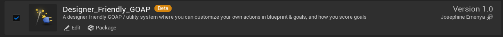

---

## Creating an AI Controller

The Planner and Reasoner components are typically managed by an AI Controller.

Create a Blueprint Class of type `ExampleController`.

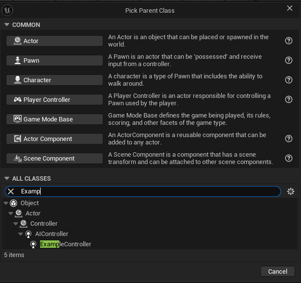{ align=center }

It should look like this:

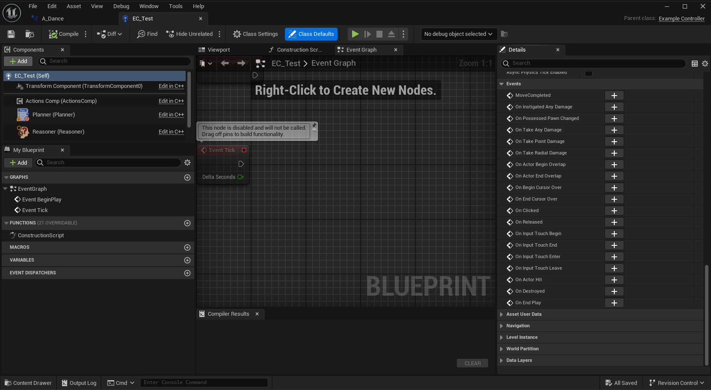

---

## Creating Actions

Actions define what the AI is capable of doing.

Create a Blueprint of type `Action`.

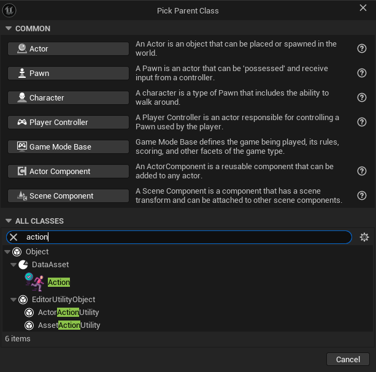{ align=center }

It should look like this:

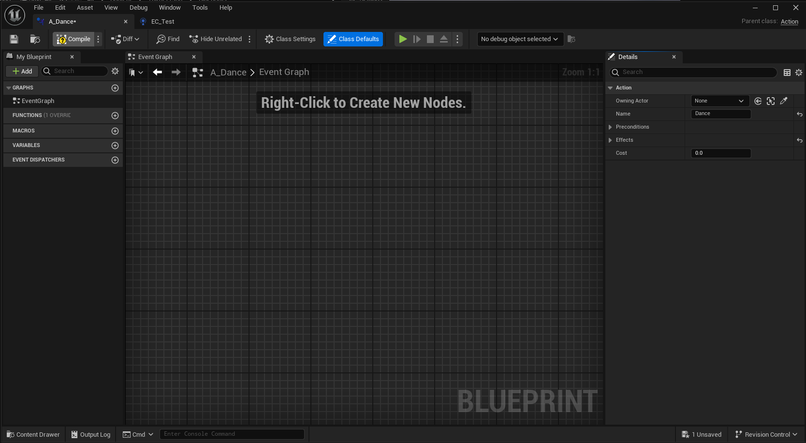{ align=center }

### Configuring Action Defaults

Click **Class Defaults**.

You should see something like this:

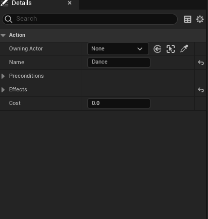

Here you define:

- **Action Name**
- **Cost**
- **Preconditions**
- **Effects**

**Preconditions** determine what must be true (or false) before the action can be executed.

**Effects** determine what becomes true (or false) after the action has been performed.

Example action with no preconditions:

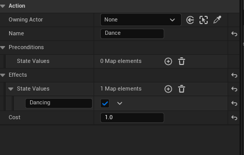{ align=center }

### Overriding Action Execution

This is where you define what happens when the action executes.

1. Click **Functions Overridable**
2. Hover over the available functions until you see:

   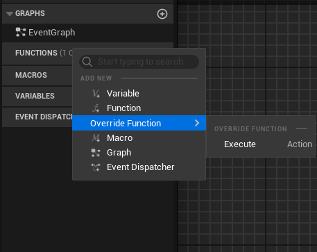

3. Click **Execute**

You should see an [`EExitSequenceType`](API_ref/exit_sequence.md) return value and an `Owner` input of type `Actor`.

If you're using `ExampleController`, `Owner` will almost certainly be an `AIController` / `ExampleController`, so you can safely cast it.

`Owner` is typed as `Actor` to allow flexibility for users who place Planner and Reasoner Components directly on the character instead of the controller.

Now implement the action's behaviour.

Example action that changes material and teleports the AI:

<iframe
    src="https://blueprintue.com/render/p-d1f-r9/"
    width="900"
    height="400"
    scrolling="no"
    allowfullscreen>
</iframe>

### Adding Actions to the Planner

Now register the action with the Planner.

1. Return to your `ExampleController`
2. Select the **Planner Component**
3. In the **Details** panel, scroll to **Planner Settings**

You should see:

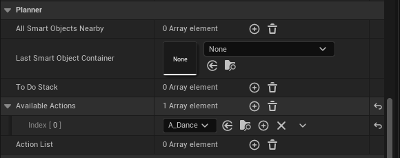

Add your newly created Action Blueprint to **Available Actions**.

The Planner can now consider this action when building plans.

---

## Creating Goals

Goals define what the AI is trying to achieve.

Create a Blueprint of type `Goal`.

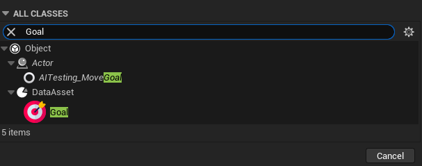

It should look like this:

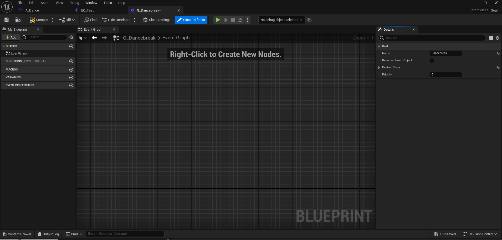

### Configuring Goal Defaults

Click **Class Defaults**.

You should see:

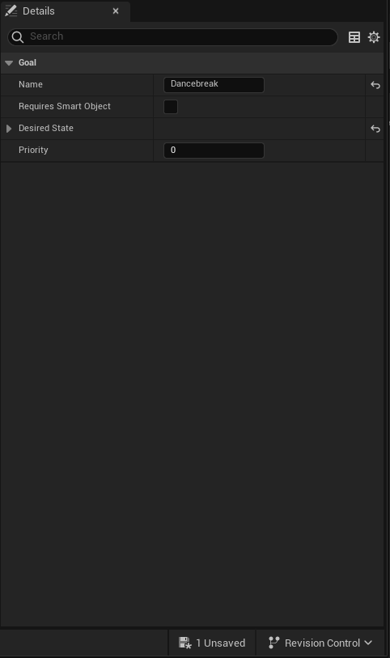

Set the desired world state required to satisfy this goal.

Note, please ignore the boolean value for Smart Objects, at the time of release this should be deprecated

---

### Adding Goal Utility 

If you are using Utility AI behaviour, override `GetUtility()` to assign a score to this goal.

The Reasoner uses this score to determine which goal should be prioritised.

1. Click **Functions Overridable**
2. Hover over the available functions
3. Click **GetUtility**

You should see a function returning a `float`, along with a `Blackboard` input of type `UBlackboardComponent`.

Implement your utility logic here.

Example:

<iframe
    src="https://blueprintue.com/render/vzrg7-ln/"
    width="900"
    height="400"
    scrolling="no"
    allowfullscreen>
</iframe>

### Adding Goals to the Reasoner

Now register the goal with the Reasoner.

1. Return to your `ExampleController`
2. Select the [`Reasoner`](API_ref/reasoner_api.md) component
3. Scroll through the **Details** panel until you find the goal classes list

You should see:

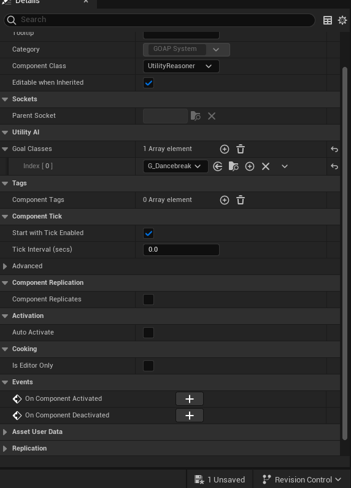

Add your newly created Goal Blueprint.

The Reasoner can now evaluate and prioritise this goal.

---

## Creating the Character

Create a Character Blueprint that will use your AI Controller.

1. Open your Character Blueprint
2. Click **Class Defaults**
3. Find **AI Controller Class**
4. Assign your newly created `ExampleController`

Place the character in your level and press **Play**.

Your AI should now be able to:

- Evaluate goals
- Build plans
- Execute actions

---

## Need Help?

If you run into problems, see the [FAQ](faq.md).