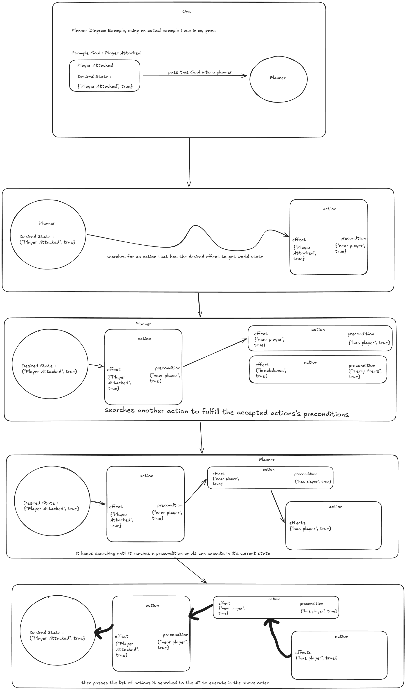

# Planner

### Description: 
The Planner performs backward cost-based planning.

Rather than simulating actions forward from the current world state, it begins with the desired Goal state and works backwards.

## Diagram : 

For each unsatisfied requirement:

- Find Actions whose Effects satisfy that requirement
- Add the Action's Preconditions as new requirements
- Remove requirements already satisfied by the Action
- Accumulate Action Cost
- Continue until all requirements are resolved

Candidate plans are evaluated using:

FinalCost = AccumulatedCost + HeuristicEstimate

The Planner in the plugin is bound to 100 actions per goal, if that limit is exceeded the Planner will immediately exit and return an empty array of actions

## Common Planner Pitfals: 

### The Planner cannot find a valid Plan : 
- No Actions have been added to the Planner
- The Goal's desired state cannot be satisfied by any available Action
- An Action required to reach the Goal is missing
- Preconditions create an impossible  circular dependency chain

Solution : 

Work backward from the Goal State :

Goal -> Required State -> Which Action produces that state?

---
### State Values names do not match exactly :

State Values are matched by the *exact* name

For Example, these are treated as completely different states:

- `HasWeapon`
- `Has Weapon`
- `hasweapon`
- `hasWeapon`

Please make sure naming is consistent across, Goal Desired States, Actions Preconditions and Effects. 

---

### Negative World States are not currently supported : 

For Example : 

- `HasWeapon` = true ✅ *supported!*
- `TargetAlive` = false ⚠️ *not supported as of now*

Actions can satisfy required states, but contradictory or negative-state reasoning is not currently supported.

---

### The Planner reaches its search limit

The current Planner uses a bounded search to prevent infinite looping.

Very large action graphs or circular dependencies may cause planning to terminate early without finding a solution.

In the case this happens:

- Simplify your Action graph
- Reduce dependency complexity
- Check for circular requirements

---

You can also check [FAQ](faq.md) for any other pitfalls